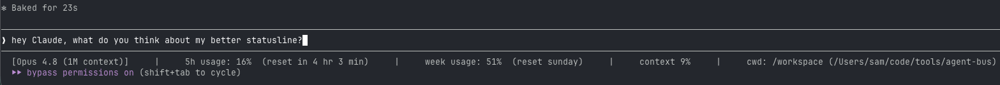
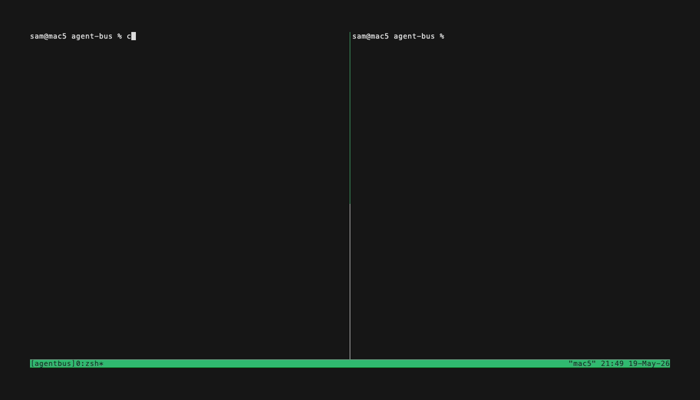

# Sroose's Claude Code plugins

A small marketplace of Claude Code plugins maintained by [@Sroose](https://github.com/Sroose).

## Install the marketplace

```
/plugin marketplace add Sroose/claude-plugins
```

Then install individual plugins:

```
/plugin install <plugin-name>@sroose-plugins
```

## Plugins

### [better-statusline](plugins/better-statusline/) — richer status line

> A Claude Code status line showing the model, 5-hour and weekly rate-limit usage (with resets), context-window %, and working directory. `/better-statusline:apply` wires it into your `~/.claude/settings.json` for you.

```
/plugin install better-statusline@sroose-plugins
/reload-plugins              # activate the plugin in the current session
/better-statusline:apply     # wire the status line into ~/.claude/settings.json
```



→ [plugins/better-statusline/README.md](plugins/better-statusline/README.md) for usage.

### [agent-bus](plugins/agent-bus/) — inter-session messaging

> Let two or more Claude Code sessions on the same machine talk to each other. Register each session as a named agent (`OBSIDIAN`, `CODE`, `INFRA`, …) and they exchange messages, with incoming messages auto-surfacing in the recipient's transcript — no user typing needed.

```
/plugin install agent-bus@sroose-plugins
```



→ [plugins/agent-bus/README.md](plugins/agent-bus/README.md) for usage, [DESIGN.md](plugins/agent-bus/DESIGN.md) for internals.

### [confluence-sync](plugins/confluence-sync/) — Confluence Cloud ↔ Markdown sync

> Keep local Markdown shadow files in sync with Confluence Cloud pages. Read-only against Confluence: pulls snapshots, manages pre-edit checkpoints, orchestrates the edit→apply→verify loop, and triages deviations after you apply changes manually in the Confluence editor.

```
/plugin install confluence-sync@sroose-plugins
pip install markdownify    # one-time, required dependency
```

→ [plugins/confluence-sync/README.md](plugins/confluence-sync/README.md) for usage, [SKILL.md](plugins/confluence-sync/skills/confluence-sync/SKILL.md) for the full workflow.

### [jira-fetch](plugins/jira-fetch/) — Jira Cloud issues → Markdown

> Pull a Jira Cloud issue (key, metadata, description, comments) into a local Markdown file so Claude can read it while working in your repo. The sibling of confluence-sync: same session-cookie auth and HTML→Markdown pipeline, but for issues instead of wiki pages, and one-way — **read-only against Jira**, no apply/verify loop.

```
/plugin install jira-fetch@sroose-plugins
pip install markdownify    # one-time, required dependency
```

→ [plugins/jira-fetch/README.md](plugins/jira-fetch/README.md) for usage, [SKILL.md](plugins/jira-fetch/skills/jira-fetch/SKILL.md) for the full workflow.

### [whisper-transcribe](plugins/whisper-transcribe/) — local/LAN whisper.cpp transcription + context-aware summary

> Transcribe audio/meeting recordings via a [whisper.cpp](https://github.com/ggerganov/whisper.cpp) `whisper-server` (local, LAN, or Tailscale tailnet) and write a concise summary (action points + decisions) next to the recording. Context can be supplied as files or an inline `--context-text "..."` string, used to cross-link ids and sharpen names without rewriting the summary. The server URL is asked once on first use — nothing hardcoded; audio and transcripts stay on your own machines.

```
/plugin install whisper-transcribe@sroose-plugins
```

→ [plugins/whisper-transcribe/README.md](plugins/whisper-transcribe/README.md) for usage, [server-setup/README.md](plugins/whisper-transcribe/server-setup/README.md) for running the whisper-server.

## Marketplace-level changes

See [CHANGELOG.md](CHANGELOG.md) for plugin additions, removals, and renames at the marketplace level. Each plugin tracks its own version history in `plugins/<name>/CHANGELOG.md`.

## License

MIT — see [LICENSE](LICENSE). Same license applies to all plugins in this marketplace.
